# 🔥 notice

#### I haven't refactored yet so the code may look messy.


#### I plan to complete the refactoring in early 2020.


<br />

  <h1 align="center">TAMRA</h1>

  <p align="center">
    Social Network Service for everyone <br/>
	<br/>
with Spring Boot
    <br />
   </p>

&nbsp;
<!-- TABLE OF CONTENTS -->
## Table of Contents

* [About the Project](#about-the-project)
  * [Built With](#built-with)
* [Getting Started](#getting-started)
  * [Prerequisites](#prerequisites)
  * [Java](#java)
  * [Start Tamra locally](#start-tamra-locally)
* [Details](#details) 
  * [Features](#features) 
  * [Deploy](#deploy)
  * [Document](#document)
  * [Demo](#demo)
 * [Contact](#contact)

&nbsp;
<!-- ABOUT THE PROJECT -->
## About The Project


<div align="center">
<br/>
  <p align="center"><b>모두가 편리하게 사용할 SNS 서비스, 탐라 Tamra</b></p>
</div>


&nbsp;
### Built With
* redux

* redux-pender

* react

* react-router-dom

* react-redux

* redux-actions

* immutable

* styled-components

* axios

* lodash

* query-string

* styled-components

* open-color

* Kakao api

* backend repo : [https://github.com/juhyeon96/Sns-timeline](https://github.com/juhyeon96/Sns-timeline)

&nbsp;

## Getting Started

For development, you need to install yarn that is package manager in javascript.

&nbsp;
### Start Tamra locally

1. Clone the repo
```sh
$ git clone https://github.com/jeongdaeun98/timeline_front
```
2. Move to project directory
```sh
$ cd fronttimeline
```
3. run
```
$ yarn start
```
&nbsp;
## Details 

### Features
1. membership 
	- sign up/ in/ out
	- kakao sign up/ in/ out
	- upload/edit user image
	- edit user info
	- validation
	- manage alarm
	- search user
2. follow
	- follow
	- unfollow
	- alarm
	- search friend list
3. post
	- post create/ read/ update/ delete
	- manage show level of each post
	- upload images
	- comment create/ read
	- like/ cancel like to post
	- tag friends
	- alarm : about tag
4. newsfeed
	- get user-profile
		- total post
		- total followers
		- total following
		- post list
	- main page
		- my posts
		- friends' posts for followers/public
		- my news of like/ comment
		- friends' news of like/ comment

### Deploy
* AWS EC2 
* <b>Link : [http://tamra.site/](http://tamra.site/)</b>
&nbsp;
### Document
* [Figma](https://www.figma.com/file/sOR2wXynyU4LXFg2lYkBTs/TIMELINE-%EC%8A%A4%ED%86%A0%EB%A6%AC%EB%B3%B4%EB%93%9C?node-id=0%3A1!)
&nbsp;
### Demo

<div align="center">

## write ✍️

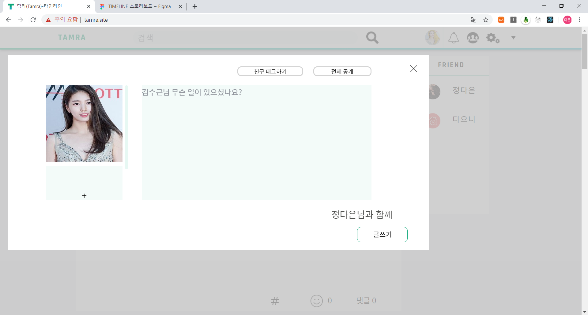
&nbsp;
&nbsp;
## friendTag #️⃣

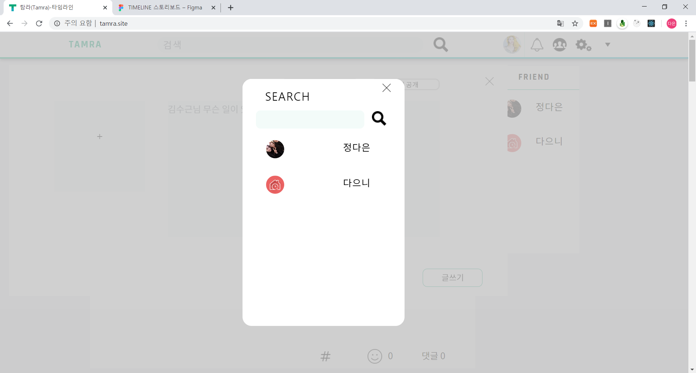
&nbsp;
&nbsp;
## Comment

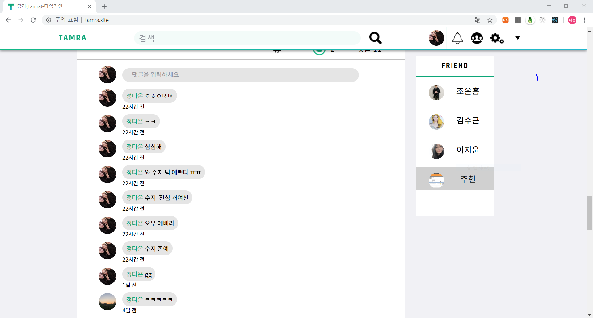
&nbsp;
&nbsp;
## Add to friend List when following interactive 🧑‍🤝‍🧑

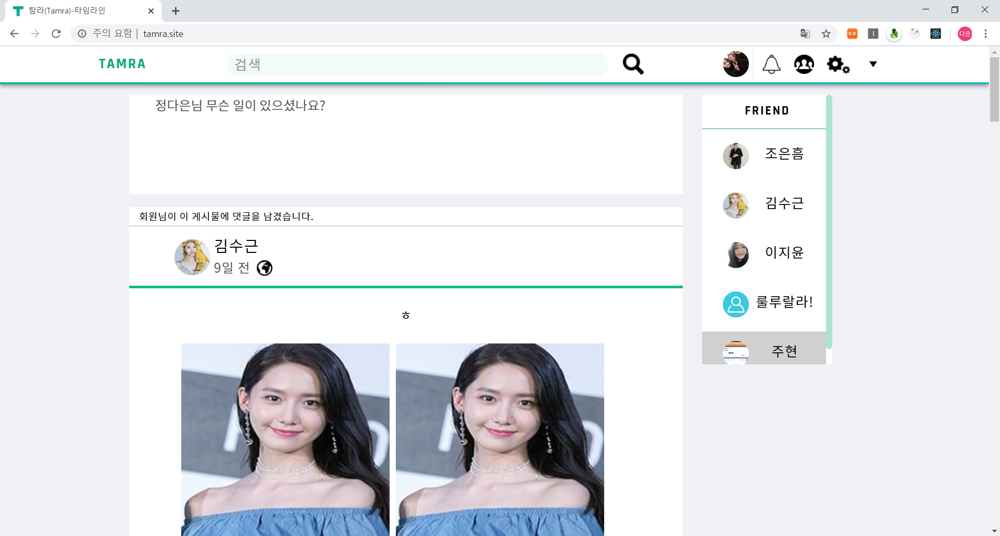
&nbsp;
&nbsp;
## friendAlarm ⏰

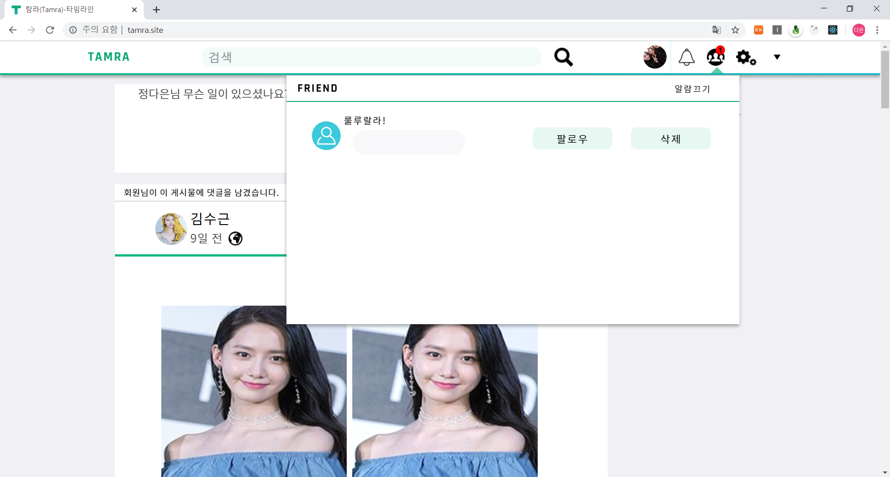
&nbsp;
&nbsp;
## BasicAlarm ⏰

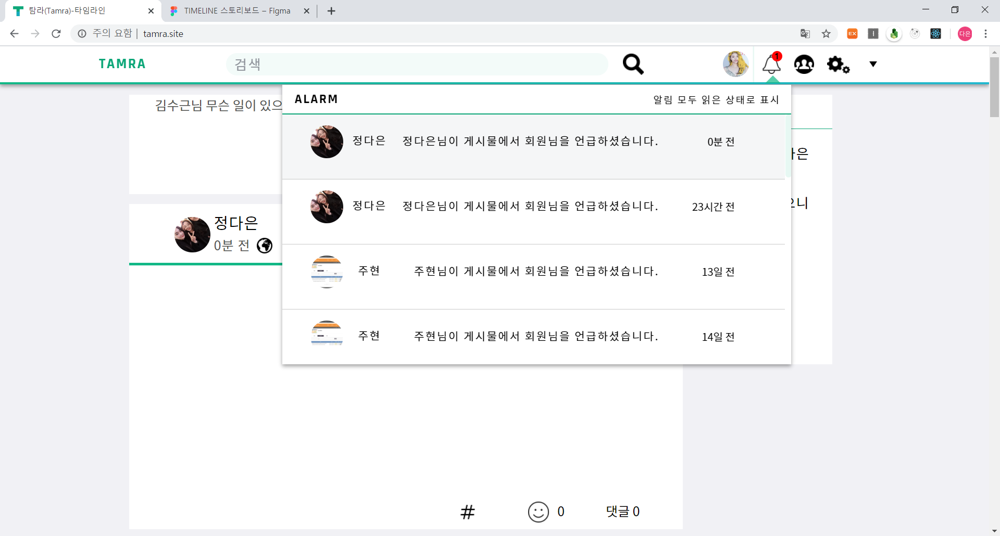
&nbsp;
&nbsp;
## friendProfile 😃

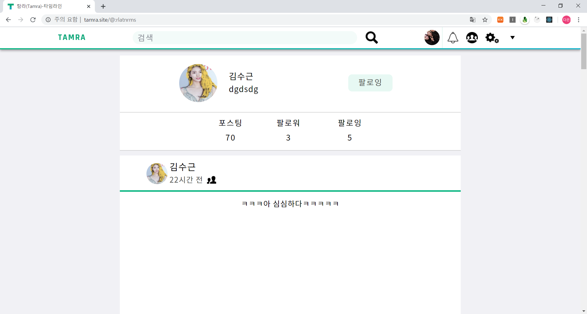
&nbsp;
&nbsp;
## friendSearch 🔍

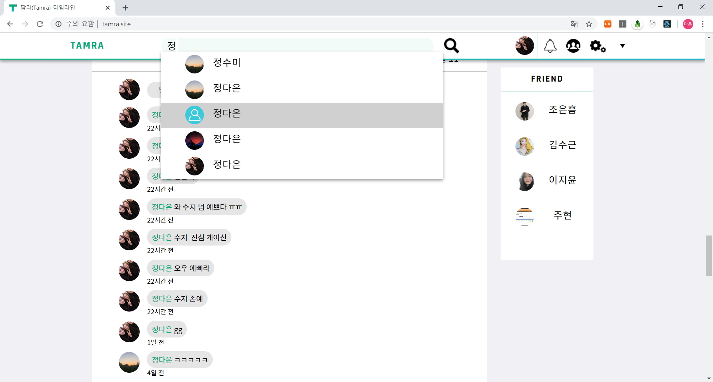
&nbsp;
&nbsp;
## myPage 📄

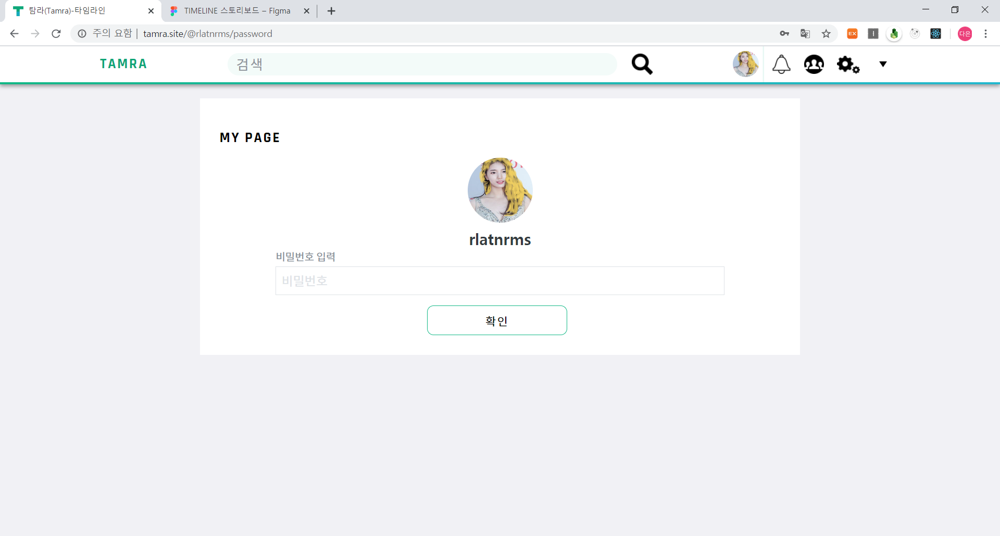

.PNG)
&nbsp;
&nbsp;
## myProfile 🙍
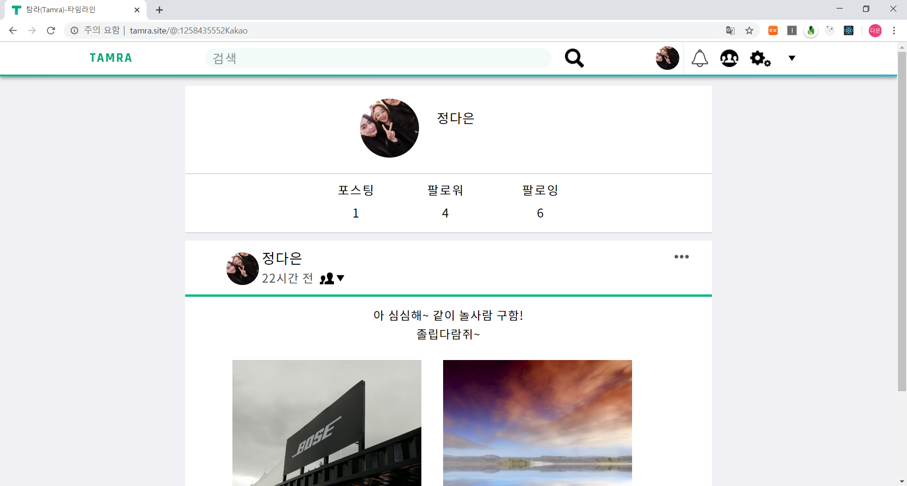
&nbsp;
&nbsp;
### Delete feed

&nbsp;
&nbsp;
### Modify text 

&nbsp;
&nbsp;
### Modify view phase
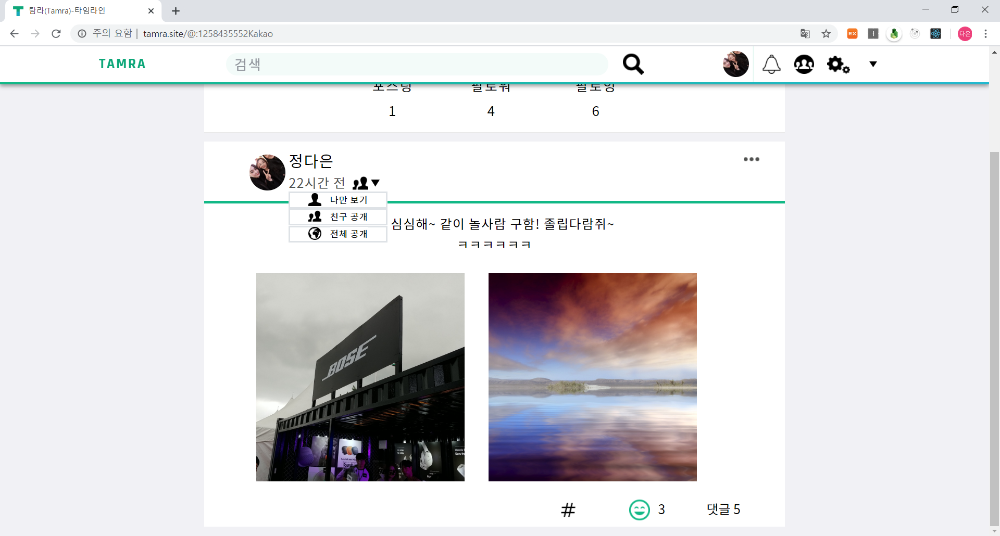
&nbsp;
&nbsp;
## Security 🔑
&nbsp;
&nbsp;
### logout

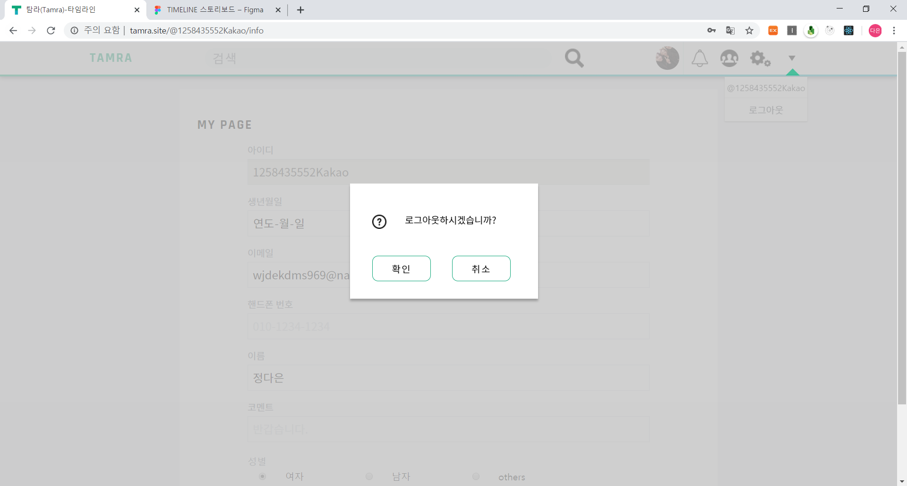
 &nbsp;
&nbsp;
### SignIn

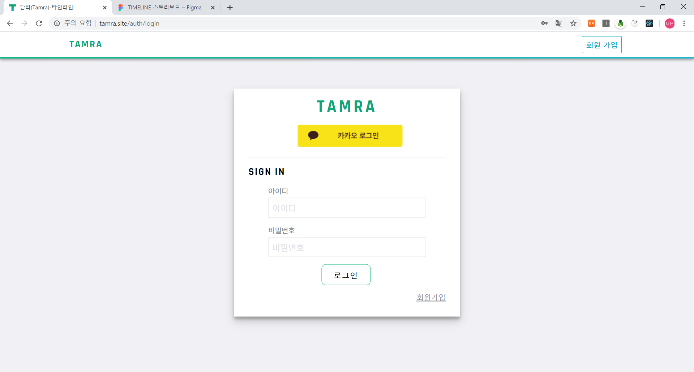
 &nbsp;
&nbsp;
### SignUp

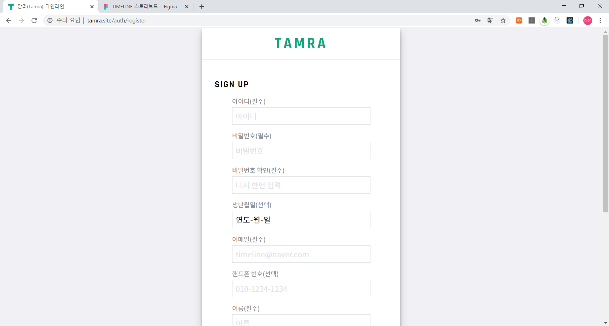
&nbsp;
&nbsp;


</div>

<!-- CONTACT -->
&nbsp;

## Contact

 - 김주현 ([juhyeon96](https://github.com/juhyeon96)) 
 - 정다은 ([jde](https://github.com/jeongdaeun98))

# 🎥

https://www.youtube.com/channel/UCMRjGZic64ud3KhPHE06gPQ

