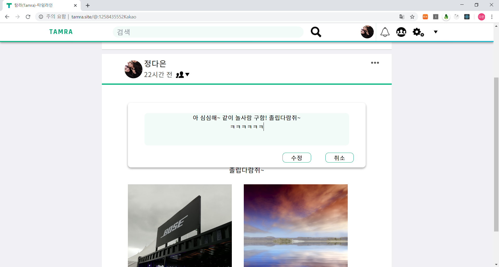

# 🔥 notice

I haven't refactored yet so the code may look messy.

I plan to complete the refactoring in early 2020.

# ⌚ web service for SNS
made by jeongdaeun98

This web service was designed and produced using Figma.

# 📋 project features

## write ✍️

## friendTag #️⃣

## Comment

## Add to friend List when following interactive 🧑‍🤝‍🧑

## friendAlarm ⏰

## BasicAlarm ⏰

## friendProfile 😃

## friendSearch 🔍

## myPage 📄

.PNG)

## myProfile 🙍
 
 
 

### Delete feed

### Modify text 

### Modify view phase

## Security 🔑

### logout

 
### SignIn

 
### SignUp

# ℹ️ OpenSource

- redux

- redux-pender

- react

- react-router-dom

- react-redux

- redux-actions

- immutable

- styled-components

- axios

- lodash

- query-string

- styled-components

# 🎥

https://www.youtube.com/channel/UCMRjGZic64ud3KhPHE06gPQ
- open-color
